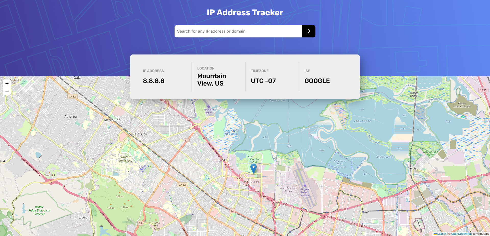
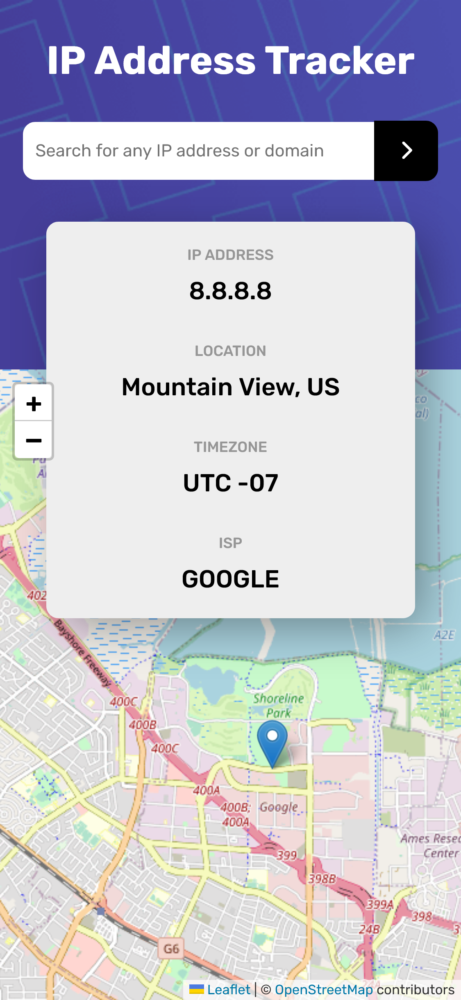

# Responsive IP Tracker App


Live website: https://fatihbulbul1.github.io/react-ip-tracker-app
# Overview
Made by:
- **React**
- Leaflet API
- ipapi API
- geolocation-db API 

### Font
```css
@import url('https://fonts.googleapis.com/css2?family=Rubik:wght@400;500;700&display=swap');
font-family: 'Rubik', sans-serif;
```
## Description 
- This website created for Frontend Mentor challenge. [Check challenge](https://www.frontendmentor.io/challenges/ip-address-tracker-I8-0yYAH0/hub/ip-address-tracker-BxWSZbRzVC)
- Automatically sets info for your IP address.
- Location with map, timezone and ISP detection.
- Responsive design.

### Author
- LinkedIn - [Ömer Fatih Bülbül](https://www.linkedin.com/in/ömer-fatih-bülbül-74a890236/)
- Twitter - [fatihbulbul91](https://twitter.com/fatihbulbul91)
- Frontend Mentor - [fatihbulbul1](https://www.frontendmentor.io/profile/fatihbulbul1)